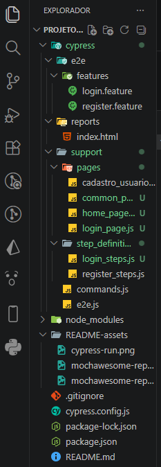
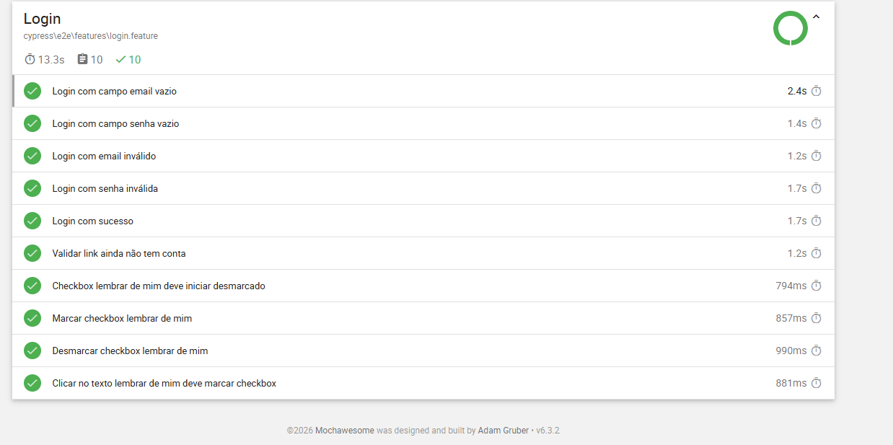
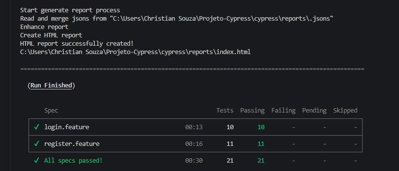

# 🚀 Automação de Testes E2E com Cypress + Cucumber


Projeto de automação de testes End-to-End desenvolvido com foco em boas práticas de QA, utilizando Cypress, Cucumber (BDD), Page Object Pattern e geração de dados dinâmicos com Faker.

O objetivo do projeto é validar fluxos críticos da aplicação, como Login e Cadastro de Usuário, cobrindo cenários positivos e negativos.

---

# 📸 Estrutura do projeto



---

# 🛠 Tecnologias utilizadas

- Cypress
- Cucumber / Gherkin
- JavaScript
- Faker JS
- Mochawesome Reporter
- Page Object Pattern (POM)

---

# 📂 Estrutura do projeto

```bash
cypress
 ├── e2e
 │    └── features
 │         ├── login.feature
 │         └── register.feature
 │
 ├── reports
 │    └── index.html
 │
 ├── support
 │    ├── pages
 │    │     ├── cadastro_usuario_page.js
 │    │     ├── login_page.js
 │    │     ├── home_page.js
 │    │     └── commum_page.js
 │    │
 │    └── step_definitions
 │          ├── login_steps.js
 │          └── register_steps.js
 │
 ├── e2e.js
 │
cypress.config.js
package.json
```

---

# ✅ Funcionalidades automatizadas

## 🔐 Login

- Campo email vazio
- Campo senha vazio
- Email inválido
- Senha inválida
- Login com sucesso
- Validação de mensagens de erro
- Validação de mensagem de sucesso
- Validação do link de cadastro
- Checkbox "Lembrar de mim"

---

## 📝 Cadastro de usuário

- Campo nome vazio
- Campo email vazio
- Campo email inválido
- Campo senha vazio
- Campo senha inválida
- Cadastro com sucesso
- Cadastro com email sem arroba
- Cadastro com senha mínima permitida
- Validação de campos visíveis
- Validação do botão cadastrar

---

# 🧠 Boas práticas aplicadas

✔️ Page Object Pattern  
✔️ Separação de responsabilidades  
✔️ Cenários em Gherkin  
✔️ Dados dinâmicos com Faker  
✔️ Reutilização de steps  
✔️ Estrutura organizada para escalabilidade  
✔️ Relatórios HTML automatizados  

---

# 📊 Relatórios de teste

O projeto utiliza o Mochawesome Reporter para geração de relatórios HTML automatizados contendo:

- Cenários executados
- Status dos testes
- Tempo de execução
- Evidências de falha
- Screenshots automáticos

---

## 📸 Exemplo do relatório HTML



---

## 📸 Execução dos testes



---

# ▶️ Como executar o projeto

## 1️⃣ Clonar o repositório

```bash
git clone https://github.com/ChristianSouza12/cypress-cucumber-e2e-tests
```

---

## 2️⃣ Instalar as dependências

```bash
npm install
```

---

## 3️⃣ Executar o Cypress em modo visual

```bash
npx cypress open
```

---

## 4️⃣ Executar os testes em modo headless

```bash
npx cypress run
```

---

# 📌 Exemplo de cenário BDD

```gherkin
Scenario: Login com sucesso
   Given I am on login screen
   And I fill my credentials
   When I click on Login Button
   Then I see success message
```

---

# 🎯 Objetivo do projeto

Este projeto foi desenvolvido com foco em aprendizado e evolução na área de Quality Assurance, aplicando automação de testes E2E utilizando ferramentas amplamente utilizadas no mercado.

---

# 👨‍💻 Autor

Christian Souza

🔗 LinkedIn:  
https://www.linkedin.com/in/christian-souzaa/

🔗 GitHub:  
https://github.com/ChristianSouza12
